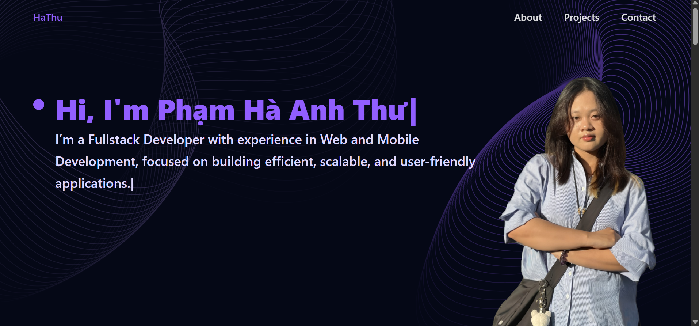

# My Personal Portfolio Website

[](https://hathu-portfolio.vercel.app)
[](https://github.com/hathuanihi/portfolio)

 
Đây là website portfolio cá nhân của tôi, được xây dựng để giới thiệu các dự án, kỹ năng và kinh nghiệm của bản thân. Trang web được thiết kế với giao diện hiện đại, tương tác và hoàn toàn đáp ứng (responsive) trên cả thiết bị máy tính và di động.

## ✨ Các tính năng nổi bật

- **Mô hình 3D tương tác:** Xây dựng với **Three.js** để tạo ra trải nghiệm người dùng sống động và hấp dẫn.
- **Trưng bày dự án:** Một khu vực riêng để hiển thị các dự án nổi bật của tôi, kèm theo liên kết đến mã nguồn và demo trực tiếp.
- **Dòng thời gian kinh nghiệm:** Trình bày quá trình học tập và kinh nghiệm làm việc một cách trực quan.
- **Thiết kế Responsive:** Giao diện được tối ưu hóa để hiển thị mượt mà trên mọi kích thước màn hình.
- **Biểu mẫu liên hệ:** Tích hợp với **EmailJS** để mọi người có thể liên hệ trực tiếp một cách dễ dàng và nhanh chóng.

## 🛠️ Công nghệ sử dụng

Dự án này được xây dựng bằng các công nghệ hiện đại nhất:


## 🚀 Hướng dẫn cài đặt và chạy dự án

Để chạy dự án này trên máy của bạn, hãy làm theo các bước sau:

**1. Clone repository**
```bash
git clone [https://github.com/hathuanihi/portfolio.git](https://github.com/hathuanihi/portfolio.git)
cd portfolio
```
**2. Cài đặt các dependencies**
```bash
npm install
```
**3. Cấu hình biến môi trường**
Tạo một file có tên .env ở thư mục gốc của dự án và thêm các biến môi trường cần thiết cho EmailJS.
```bash
# EmailJS
VITE_EMAILJS_SERVICE_ID=your_service_id
VITE_EMAILJS_TEMPLATE_ID=your_template_id
VITE_EMAILJS_PUBLIC_KEY=your_public_key
```
**4. Chạy development server**
```bash
npm run dev
```
Mở http://localhost:5173 (hoặc một port khác) trên trình duyệt để xem dự án.

📫 Liên hệ
Phạm Hà Anh Thư - hathu20905@gmail.com
